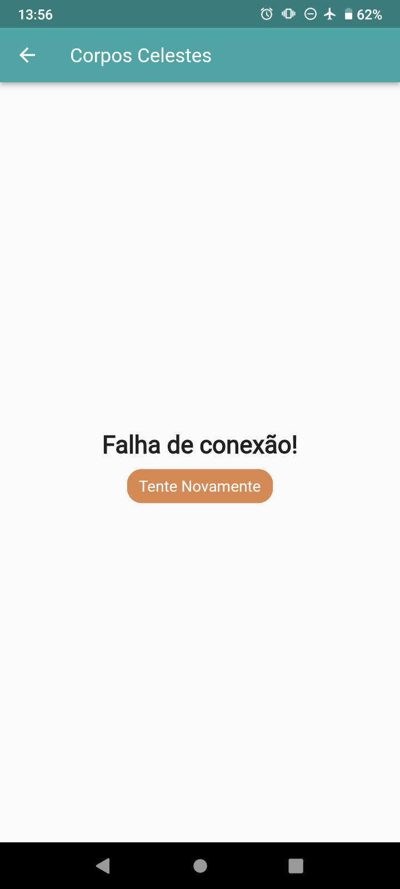
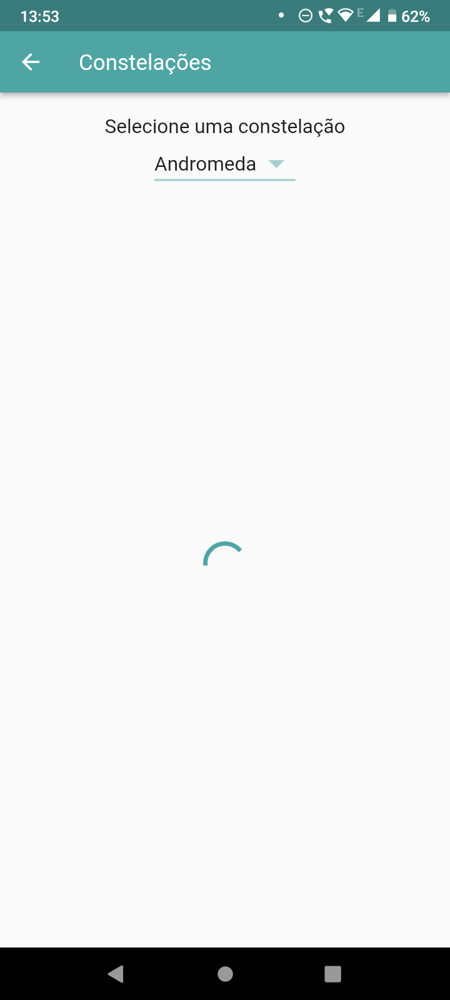

## App Flutter

Desafio para a vada em Desenvolvimento Flutter da empresa Server Softwares para Varejo.

## Telas:

- Tela de Fase da Lua: Tela na qual é realizada uma requisição para obter uma imagem da fase da Lua para a data selecionada;

- Tela de Corpo Celeste (Ícone do Sol): Tela na qual são realizadas duas requisições: uma para obter os corpos celestes disponíveis do Sistema Solar e outra para obter os dados do corpo celeste selecionado;

- Tela de Constelação (Ícone da Estrela): Tela na qual é realizada uma requisição para obter uma imagem da constelação selecionada;

- Tela de Favoritos (Íconde do Coração): Tela na qual são exibidas as imagens da Fase da Lua salvas na tela inicial;

## Arquitetura:

Clean Architecture + MVVM

## Principais bibliotecas:

- Gerenciamento de estado: Value Notifier;
- Requisições HTTP: Dio;
- Injecão de dependência e gerenciamento de rotas: Flutter Modular;
- Internaciolização: Flutter Intl;
- Banco de dados local: Hive;
- Geolocalização: Geolocator;
- Testes visuais de componentes: Widgetbook;
- Testes unitários: Mockito;

## Screenshots:

               

